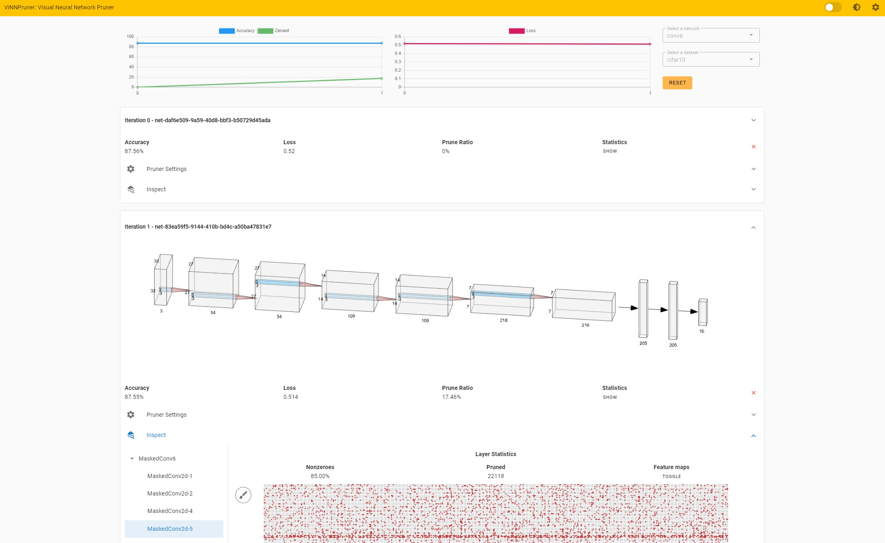

# ViNNPruner

Code repository for the paper 'ViNNPruner: Visual Interactive Pruning for Deep Learning' (https://arxiv.org/abs/2205.15731).  
An interactive demo can be found at https://interactive-pruning.dbvis.de/.

## Welcome

This is the home of ViNNPruner, an interactive pruning tool for deep neural networks.



## Frontend Setup

### Installation

In order to run the frontend, you need Node 12LTS or greater.

It may be possible that you might need to install vue-cli depending on your system configuration.
If there are any errors during build, please also run:

```
npm install -g @vue/cli
```

### Setup

Navigate to the `frontend` directory and run:

```
npm install
```

Afterwards, you need to build the project.

### Build

```
npn run build
```

### Run

After completion, run the frontend web server by entering the following command:

```
npm run serve
```

## Backend Setup

### PyTorch

The interactive pruning backend uses PyTorch. It was originally written for PyTorch 1.8.1.
It is highly recommended using an environment.

Navigate into the `backend` directory and run:

```
pip install -r requirements.txt
```

### Run

After all packages installed successfully, run:

```
flask run
```

## Use the app

The app will be available at http://localhost:8080

Results may take a while to load on first-run as datasets are downloaded on demand.

---

Used Third Party Libraries & Research

-   Vue (MIT, https://github.com/vuejs/vue/blob/main/LICENSE)
-   Vuetify (MIT, https://github.com/vuetifyjs/vuetify/blob/master/LICENSE.md)
-   Flask (BSD Clause 3m, https://github.com/pallets/flask/blob/main/LICENSE.rst)
-   Pillow (HPND License, https://github.com/python-pillow/Pillow/blob/main/LICENSE)
-   Pytoch-Model-Summary (MIT, https://github.com/amarczew/pytorch_model_summary)
-   Lookahead Pruning (https://github.com/alinlab/lookahead_pruning)

## License

Released under MIT License. See the LICENSE file for details.

## Reference

```
@conference{,
 author = {Schlegel, Udo and Schiegg, Samuel and Keim, Daniel A.},
 booktitle = {Machine Learning Methods in Visualisation for Big Data 2022 @ EuroVis 2022},
 title = {ViNNPruner: Visual Interactive Pruning for Deep Learning},
 year = {2022}
}
```

